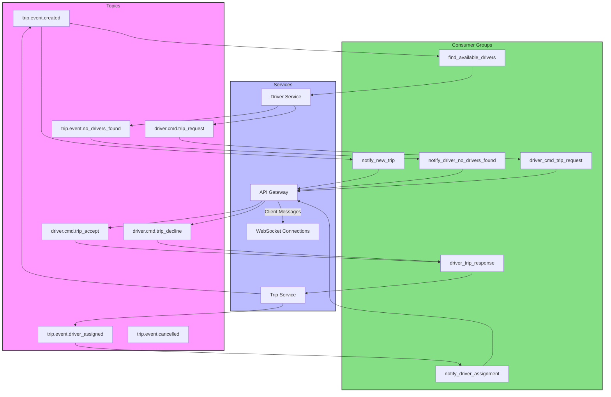

```mermaid
graph TD
    subgraph Topics
        E1[trip.event.created]
        E2[trip.event.driver_assigned]
        E3[trip.event.no_drivers_found]
        E4[trip.event.cancelled]
        E5[driver.cmd.trip_request]
        E6[driver.cmd.trip_accept]
        E7[driver.cmd.trip_decline]
    end

    subgraph Groups[Consumer Groups]
        G1[find_available_drivers]
        G2[notify_new_trip]
        G3[notify_driver_assignment]
        G4[notify_driver_no_drivers_found]
        G5[driver_cmd_trip_request]
        G6[driver_trip_response]
    end

    subgraph Services
        TS[Trip Service]
        DS[Driver Service]
        AG[API Gateway]
        WS[WebSocket Connections]
    end

    %% Producers
    TS --> E1
    TS --> E2
    DS --> E3
    DS --> E5
    AG --> E6
    AG --> E7

    %% Topic subscriptions
    E1 --> G1
    E1 --> G2
    E2 --> G3
    E3 --> G4
    E5 --> G5
    E6 --> G6
    E7 --> G6

    %% Consumer Group to Service Flow
    G1 --> DS
    G2 --> AG
    G3 --> AG
    G4 --> AG
    G5 --> AG
    G6 --> TS

    %% WebSocket Connections
    AG --> |Client Messages| WS

    style Topics fill:#f9f,stroke:#333,stroke-width:2px
    style Services fill:#bbf,stroke:#333,stroke-width:2px
    style Groups fill:#85e085,stroke:#333,stroke-width:2px
```
