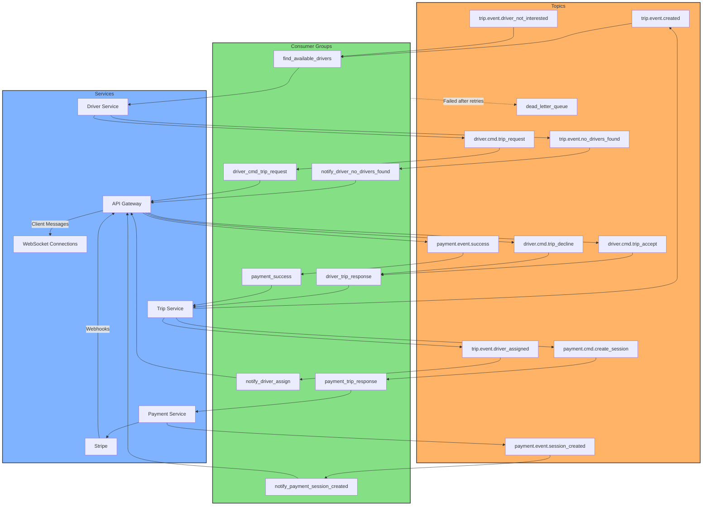

```mermaid
graph TD
    subgraph Topics
        E1[trip.event.created]
        E2[trip.event.driver_assigned]
        E3[trip.event.no_drivers_found]
        E4[trip.event.driver_not_interested]
        E5[driver.cmd.trip_request]
        E6[driver.cmd.trip_accept]
        E7[driver.cmd.trip_decline]
        E8[payment.cmd.create_session]
        E9[payment.event.session_created]
        E10[payment.event.success]
        DLQ[dead_letter_queue]
    end

    subgraph Groups[Consumer Groups]
        G1[find_available_drivers]
        G2[notify_driver_assign]
        G3[notify_driver_no_drivers_found]
        G4[driver_cmd_trip_request]
        G5[driver_trip_response]
        G6[payment_trip_response]
        G7[notify_payment_session_created]
        G8[payment_success]
    end

    subgraph Services
        TS[Trip Service]
        DS[Driver Service]
        AG[API Gateway]
        WS[WebSocket Connections]
        PS[Payment Service]
        ST[Stripe]
    end

    %% Producers
    TS --> E1
    TS --> E2
    TS --> E8
    DS --> E3
    DS --> E5
    AG --> E6
    AG --> E7
    AG --> E10
    PS --> E9

    %% Topic subscriptions
    E1 --> G1
    E4 --> G1
    E2 --> G2
    E3 --> G3
    E5 --> G4
    E6 --> G5
    E7 --> G5
    E8 --> G6
    E9 --> G7
    E10 --> G8

    %% Consumer Group to Service Flow
    G1 --> DS
    G2 --> AG
    G3 --> AG
    G4 --> AG
    G5 --> TS
    G6 --> PS
    G7 --> AG
    G8 --> TS

    %% Messages that fail after all retries
    Groups -.-> |Failed after retries| DLQ

    %% WebSocket Connections
    AG --> |Client Messages| WS
    PS --> ST

    %% Stripe Integration
    ST --> |Webhooks| AG

    style Topics fill:#ffb366,stroke:#333,stroke-width:2px
    style Services fill:#80b3ff,stroke:#333,stroke-width:2px
    style Groups fill:#85e085,stroke:#333,stroke-width:2px
```
